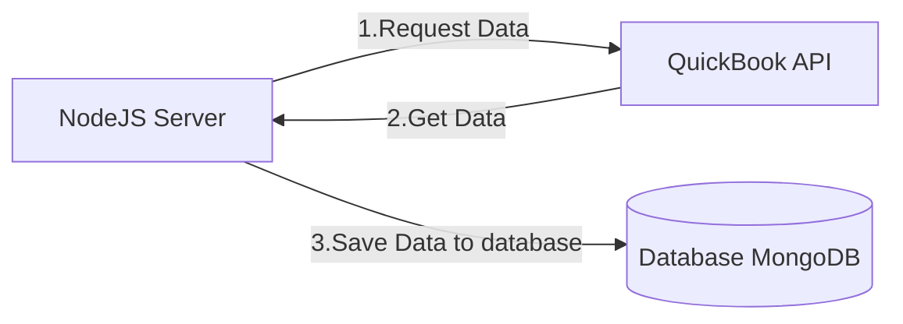

# QuickBooks NodeJS Demo

> Quickbooks Online Accounting Software

## Setup Steps

1. Setup QuickBooks Account
2. Setup `.env` using https://developer.intuit.com/app/developer/playground
3. Install dependencies `npm i`
4. Run `mkdir -p docker-data/mongodb_data`
5. Run `docker-compose up -d`
6. Start development server `npm run dev`
7. Use `api.http` for API request

---

## Notes

- Task
  - Get three details from accounting software
    - Business Details
    - Business Customers
    - Business Invoices
  - Save these details in database for any one business

---

## References

- https://developer.intuit.com/app/developer/qbo/docs/develop/sdks-and-samples-collections/nodejs

---

## Flow

---